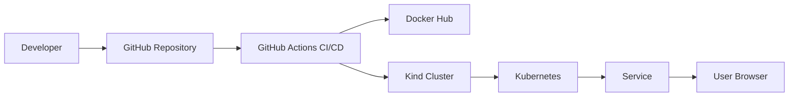
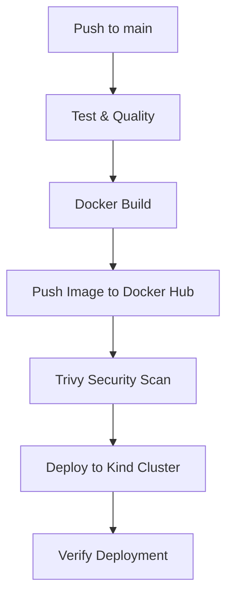
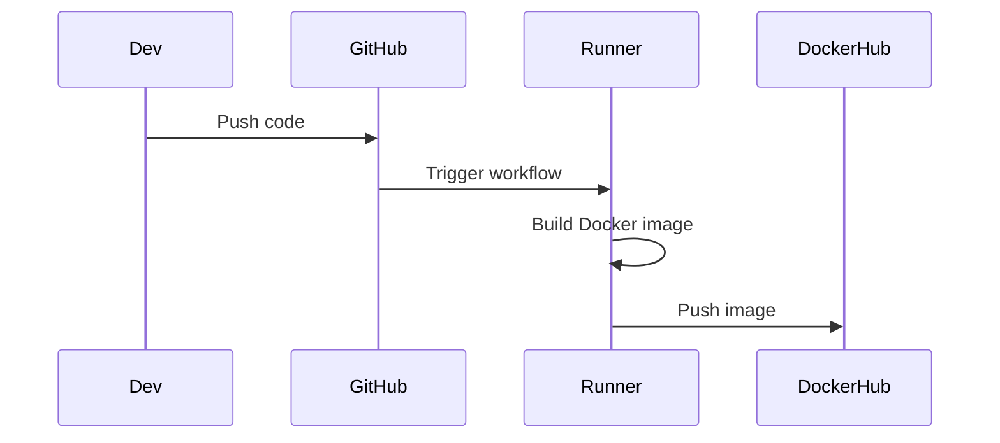
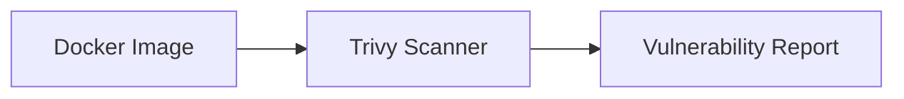
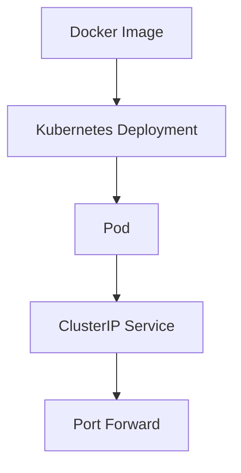

# 🚀 DevOps Demo Project

## 📌 Project Description

This project demonstrates a complete DevOps workflow for a Django application, including:

- **Docker containerization**
- **CI/CD with GitHub Actions**
- **Security scanning with Trivy**
- **Kubernetes deployment (Kind)**
- **Service exposure via port-forward**

The goal of this project is to showcase a production-style DevOps pipeline with security and container orchestration best practices.

## 🏗 Architecture Overview



## 🔁 CI/CD Pipeline Flow



### Pipeline Stages

1.  **Test & Quality**
    *   Code validation
    *   Dependency checks
2.  **Docker Build**
    *   Build image using Dockerfile
    *   Tag image with commit SHA
3.  **Push to Docker Hub**
    *   Authenticate using GitHub Secrets
    *   Push image
4.  **Security Scan**
    *   Scan Docker image using Trivy
    *   Block HIGH / CRITICAL vulnerabilities
5.  **Deploy**
    *   Create Kind cluster
    *   Apply Kubernetes manifests
    *   Verify deployment

## 🐳 Docker Workflow



### Docker Strategy
*   Slim base image
*   Dependency version control
*   Upgraded pip, setuptools, and wheel
*   Security-first build process

## 🔐 Security (DevSecOps)



### Security Measures
*   Trivy container scanning
*   Fail pipeline on HIGH / CRITICAL vulnerabilities
*   Continuous dependency upgrades
*   Secure image tagging

## ☸️ Kubernetes Deployment



### Kubernetes Components
*   Namespace isolation (`demo-devops`)
*   Deployment with replicas
*   ClusterIP Service
*   Port-forward for local access

## 🧪 Run Locally (Docker Only)

### Build image
```bash
docker build -t demo-app .
```

### Run container
```bash
docker run -p 8000:8000 demo-app
```

### Access:
http://localhost:8000

## ☸️ Run with Kubernetes

### Apply manifests:
```bash
kubectl apply -f k8s/
```

### Port-forward:
```bash
kubectl port-forward svc/demo-service 8080:80 -n demo-devops
```

### Access:
http://localhost:8080

## 📂 Project Structure

```
.
├── api/
├── k8s/
│   ├── deployment.yaml
│   ├── service.yaml
├── Dockerfile
├── requirements.txt
├── .github/workflows/
└── README.md
```

## 🔎 Verification Commands

### Check pods:
```bash
kubectl get pods -n demo-devops
```

### Check services:
```bash
kubectl get svc -n demo-devops
```

### View logs:
```bash
kubectl logs deployment/demo-app -n demo-devops
```

## 📈 Future Improvements
*   Helm chart packaging
*   AKS production deployment
*   Ingress controller
*   Prometheus & Grafana monitoring
*   Terraform infrastructure provisioning
*   Multi-environment promotion (dev → staging → prod)

## 🏆 DevOps Capabilities Demonstrated
*   CI/CD automation
*   Containerization best practices
*   DevSecOps integration
*   Kubernetes orchestration
*   Secure image scanning
*   Automated deployment validation
